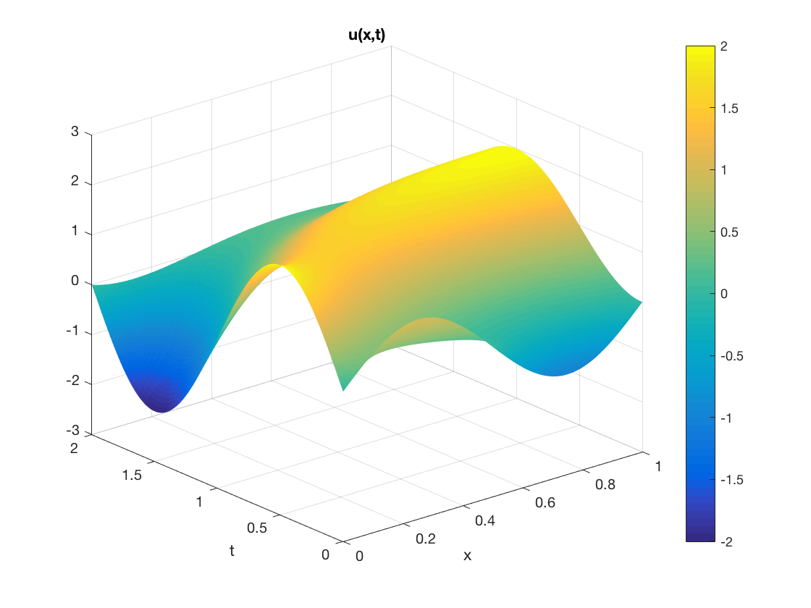
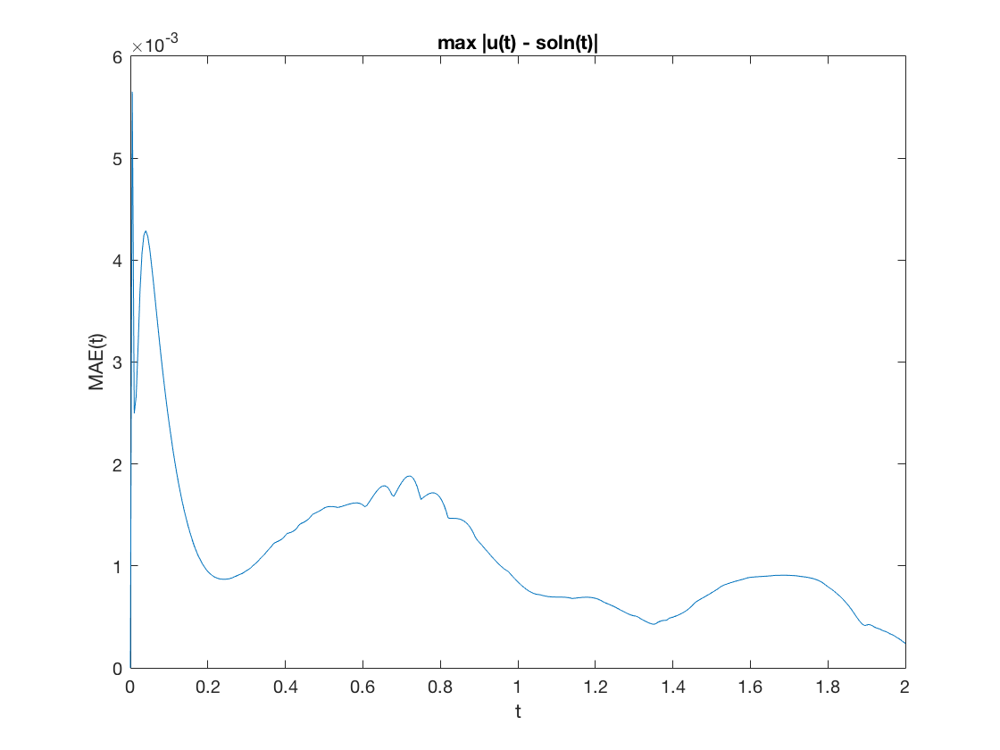

## 1D Material Balance Equation (CNM)

**An assignment submitted by Debajyoti Basu Sarkar for MAT 695 Topics in Applied Math (Numerical Methods for PDEs)—offered by Dr. Feng Tian in Fall 2017.**

  
   
  <em>The approximate solution to the initial-boundary value problem.</em>

  

  
 
<em>Generated approximate solution.</em>

  
   
  <em>Approximation Error. The maximum absolute error (MAE): 0.005652.</em>

